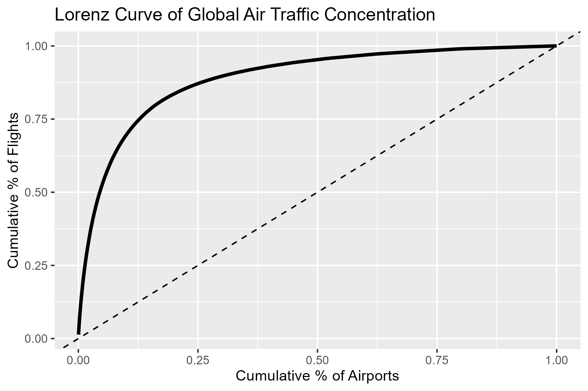
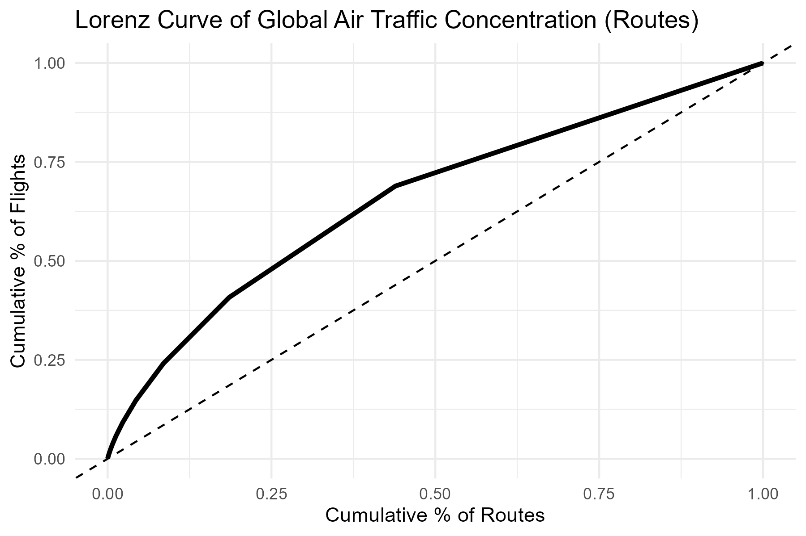
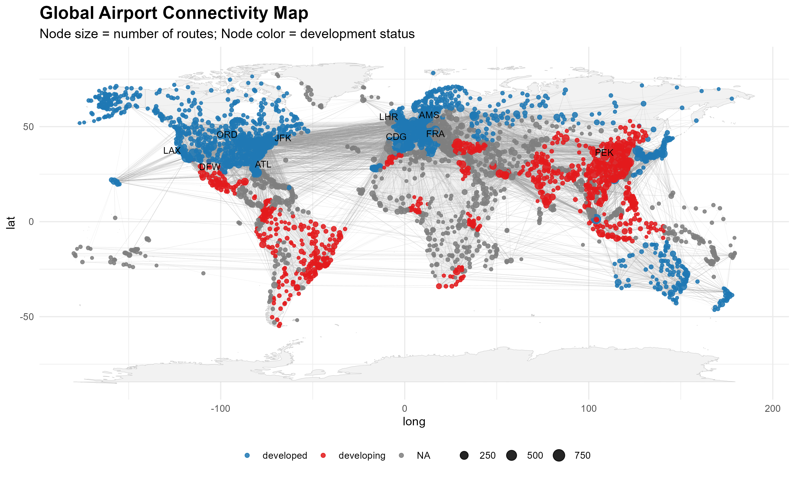

# Final_Project_Ds2020

# Global Air Travel Analysis using OpenFlights

### Lucas Martins Sorge, Nina De Grandis, Brandon Merrick

## Introduction

This data science project explores global air travel patterns using datasets from the OpenFlights database.
We analyze airline networks, airport connectivity, geographic coverage, and operational characteristics to reveal insights into global aviation trends.
Our goal during this project is to find when and where air traffic is more concentrated.
We also want to analyze the structure of global airline route networks, examine geographic coverage and identify underserved regions, and study operational characteristics, including fleet usage and route lengths.

Questions: - How concentrated is global air traffic?
- How does airport connectivity vary between developed and developing countries?
- What country has the most airports?
Where are the countries with the most airports located, and what patterns are there?
- Brandon's - Brandon's

## Data Sources

Data was obtained from [OpenFlights](https://openflights.org/data.php): - `airlines.dat`: Airlines data including operational status.
- `airports.dat`: Airport location and operational details.
- `routes.dat`: Flight routes between airports.
- `planes.dat`: Aircraft types and equipment information.
- `countries.dat`: Country codes and geographic metadata.

## Project Objectives

-   Analyze the structure of global airline route networks.
-   Examine geographic coverage and identify underserved regions.
-   Study operational characteristics, including fleet usage and route lengths.

## Completed Steps

-   Data loading and cleaning:
    -   Handling missing and invalid data.
    -   Filtering for active airlines and valid airports.
-   Joining datasets (routes, airlines, airports).

## Methodology

-   Our analysis was conducted entirely in **R**, leveraging a combination of data wrangling, statistical modeling, and visualization techniques.

## Data Cleaning

### Variables

## Results

*Question 1:* **How concentrated is global air traffic?**

-   **Extreme airport-level inequality**
    -   Lorenz Curve bows sharply below the line of perfect equality, indicating most flights funnel through a few major hubs.\
    -   **Gini coefficient (airports): 0.78**

```{r}

```

-   **Top-percentile shares**
    -   **Top 1%** of airports handle **\~20%** of all flights\
    -   **Top 5%** handle **\~53%** of all flights\
    -   **Top 10%** handle **\~70%** of all flights
-   **Leading hubs**
    -   The busiest airports—**Atlanta (ATL)**, **Chicago O’Hare (ORD)**, **Beijing Capital (PEK)**, etc.—together account for a disproportionately large share of global traffic.
-   **Route-level distribution**
    -   Lorenz Curve for routes lies closer to the equality line, showing a more even spread across connections.\
    -   **Gini coefficient (routes): 0.31**

```{r}

```

-   **Key routes**
    -   Top connections (e.g., **ORD → ATL**, **JFK → LHR**) are busiest but represent a smaller overall share compared to top airports.
-   **Conclusion**
    -   Global aviation has a **dual structure**: a small number of dominant hubs manage the bulk of air traffic, while a wide range of routes ensures broad global connectivity and operational resilience.

*Question 2:* **How does airport connectivity vary between developed and developing countries?**

-   **Stronger connectivity in developed countries**
    -   Airports in developed countries show significantly higher average connectivity than those in developing countries.
    -   **Average connectivity** (number of outgoing routes per airport) is roughly **twice as high** in developed nations.
-   **Statistical evidence**
    -   Welch Two Sample t-test: **p = 0.0079**
    -   Mann-Whitney U test: **p = 0.0228**
    -   Both confirm that the difference is **statistically significant**.
-   **Top connected countries**
    -   Most countries with the highest average connectivity (e.g., **United States**, **Germany**, **France**) are developed.
    -   Some **developing countries** like the **UAE** and **Singapore** stand out as exceptions due to geographic or economic advantages.
-   **Visual insights**
    -   A global map of airports shows large hubs (colored by development status) are clustered in **North America, Europe, and East Asia**.
    -   Airports in developing countries tend to be more **regionally focused** with lower integration into global flight networks.

```{r}

```

-   **Conclusion**
    -   Global airport connectivity reflects broader economic inequalities.
    -   Developed countries are far more integrated into the air transportation network, both in infrastructure and route diversity.

*Question 3:* **What country has the most airports? Where are the countries with the most airports located, and what patterns are there?**

*Question 4:*

*Question 5:*

## Conclusion
