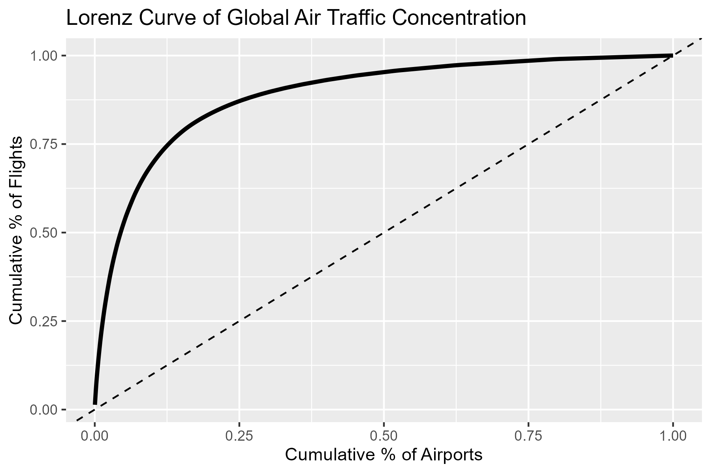
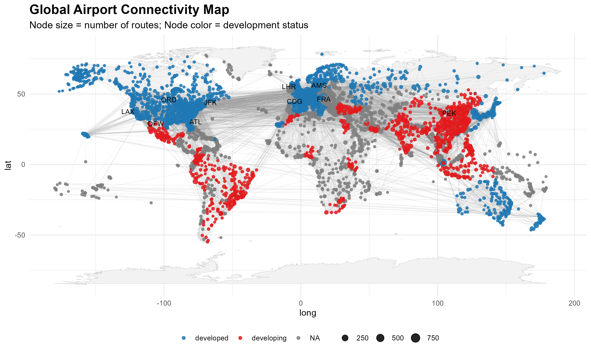
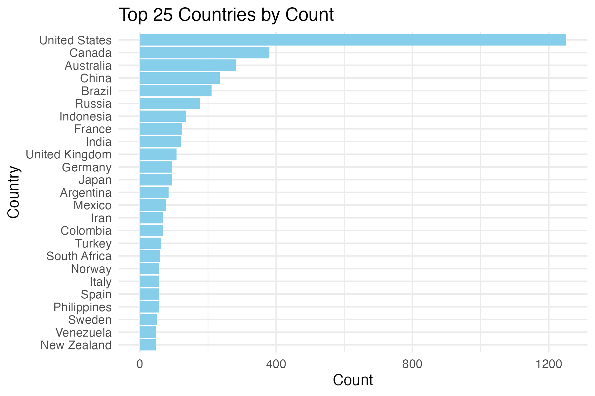
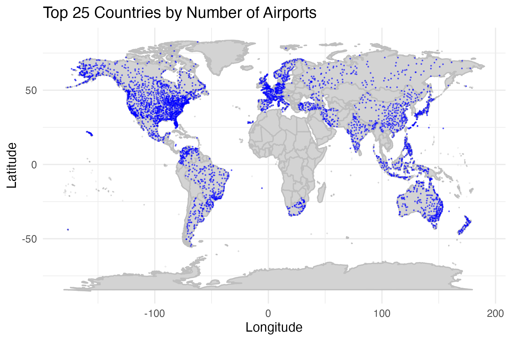
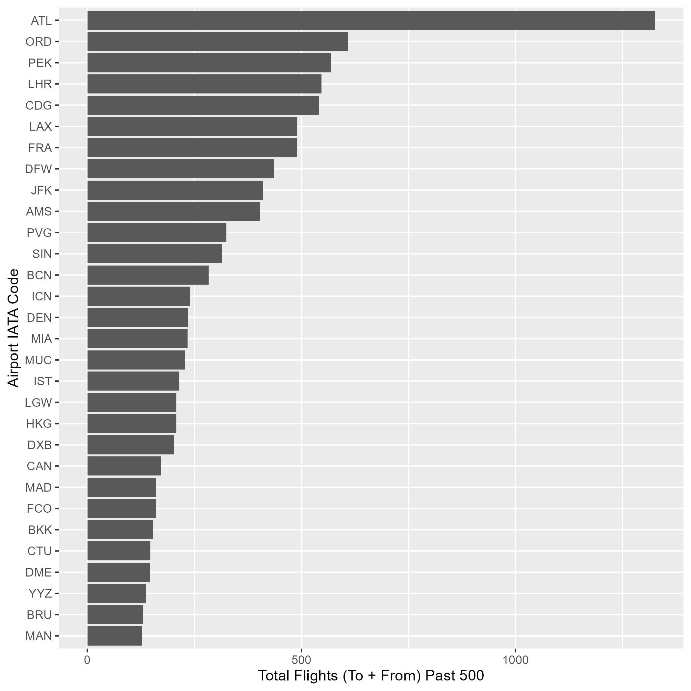
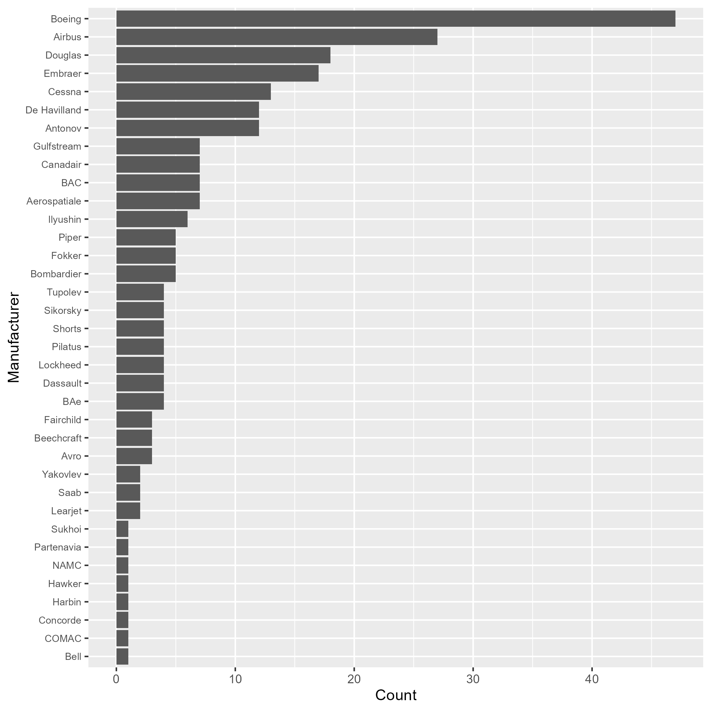

Final_Project_Ds2020
================
Lucas Martins Sorge, Nina De Grandis, Brandon Merrick
2025-05-04

- [Final_Project_Ds2020](#final_project_ds2020)
- [Global Air Travel Analysis using
  OpenFlights](#global-air-travel-analysis-using-openflights)
  - [Introduction](#introduction)
  - [Data Sources](#data-sources)
  - [Project Objectives](#project-objectives)
  - [Completed Steps](#completed-steps)
  - [Methodology](#methodology)
  - [Data Cleaning](#data-cleaning)
  - [Results](#results)
  - [Conclusion](#conclusion)

# Final_Project_Ds2020

# Global Air Travel Analysis using OpenFlights

**Lucas Martins Sorge, Nina De Grandis, Brandon Merrick**

## Introduction

This data science project explores global air travel patterns using
datasets from the OpenFlights database. We analyze airline networks,
airport connectivity, geographic coverage, and operational
characteristics to reveal insights into global aviation trends. Our goal
during this project is to find when and where air traffic is more
concentrated. We also want to analyze the structure of global airline
route networks, examine geographic coverage and identify underserved
regions, and study operational characteristics, including fleet usage
and route lengths.

Questions: - How concentrated is global air traffic? - How does airport
connectivity vary between developed and developing countries? - What
country has the most airports? Where are the countries with the most
airports located, and what patterns are there? - Brandon’s - Brandon’s

## Data Sources

Data was obtained from
[OpenFlights](https://openflights.org/data.php): - `airlines.dat`:
Airlines data including operational status. - `airports.dat`: Airport
location and operational details. - `routes.dat`: Flight routes between
airports. - `planes.dat`: Aircraft types and equipment information. -
`countries.dat`: Country codes and geographic metadata.

## Project Objectives

- Analyze the structure of global airline route networks.
- Examine geographic coverage and identify underserved regions.
- Study operational characteristics, including fleet usage and route
  lengths.

## Completed Steps

- Data loading and cleaning:
  - Handling missing and invalid data.
  - Filtering for active airlines and valid airports.
- Joining datasets (routes, airlines, airports).

## Methodology

- Our analysis was conducted entirely in **R**, leveraging a combination
  of data wrangling, statistical modeling, and visualization techniques.

## Data Cleaning

We cleaned and prepared five OpenFlights datasets (airlines, airports,
routes, planes, countries) by:

- Replacing `"\\N"` with `NA` and removing rows with missing critical
  fields.
- Filtering for relevant records: active airlines, valid airports, and
  direct routes only.
- Converting data types (e.g., IDs, coordinates) for consistency.
- Standardizing column names using `clean_names()`.
- Joining datasets: routes were linked with airline, airport, country,
  and plane details.
- Exploding and summarizing equipment data for route-level analysis.

The result is a cleaned and merged dataset ready for analysis and
visualization.

## Results

*Question 1:* **How concentrated is global air traffic?**

- **Extreme airport-level inequality**
  - Lorenz Curve bows sharply below the line of perfect equality,
    indicating most flights funnel through a few major hubs.  
  - **Gini coefficient (airports): 0.78**

``` r

```

<!-- -->

- **Top-percentile shares**
  - **Top 1%** of airports handle **~20%** of all flights  
  - **Top 5%** handle **~53%** of all flights  
  - **Top 10%** handle **~70%** of all flights
- **Leading hubs**
  - The busiest airports—**Atlanta (ATL)**, **Chicago O’Hare (ORD)**,
    **Beijing Capital (PEK)**, etc.—together account for a
    disproportionately large share of global traffic.
- **Route-level distribution**
  - Lorenz Curve for routes lies closer to the equality line, showing a
    more even spread across connections.  
  - **Gini coefficient (routes): 0.31**

``` r

```

<!-- -->

- **Key routes**
  - Top connections (e.g., **ORD → ATL**, **JFK → LHR**) are busiest but
    represent a smaller overall share compared to top airports.
- **Conclusion**
  - Global aviation has a **dual structure**: a small number of dominant
    hubs manage the bulk of air traffic, while a wide range of routes
    ensures broad global connectivity and operational resilience.

*Question 2:* **How does airport connectivity vary between developed and
developing countries?**

- **Stronger connectivity in developed countries**
  - Airports in developed countries show significantly higher average
    connectivity than those in developing countries.
  - **Average connectivity** (number of outgoing routes per airport) is
    roughly **twice as high** in developed nations.
- **Statistical evidence**
  - Welch Two Sample t-test: **p = 0.0079**
  - Mann-Whitney U test: **p = 0.0228**
  - Both confirm that the difference is **statistically significant**.
- **Top connected countries**
  - Most countries with the highest average connectivity (e.g., **United
    States**, **Germany**, **France**) are developed.
  - Some **developing countries** like the **UAE** and **Singapore**
    stand out as exceptions due to geographic or economic advantages.
- **Visual insights**
  - A global map of airports shows large hubs (colored by development
    status) are clustered in **North America, Europe, and East Asia**.
  - Airports in developing countries tend to be more **regionally
    focused** with lower integration into global flight networks.

``` r

```

<!-- -->

- **Conclusion**
  - Global airport connectivity reflects broader economic inequalities.
  - Developed countries are far more integrated into the air
    transportation network, both in infrastructure and route diversity.

*Question 3:* **What country has the most airports? Where are the
countries with the most airports located, and what patterns are there?**

Top 25 Countries by Number of Airports

``` r

```

<!-- -->

- This bar chart shows the top 25 countries by number of airports, and
  how many airports they have. I chose to only shows the top 25 because
  any more countries made the graph very hard to read.
- There are 235 countries in the data set, and everything below the top
  25 has only 45 or less airports.
- The United States takes a staggering lead, with 1251 airports. The
  next closest is Canada, with 380.
- Only the top 10 countries have 100 or more airports. - These top 10
  countries are among the most populated countries in the world, which
  would make sense why they have the most airports.

``` r

```

<!-- -->

- This map shows where the airports for the top 25 countries by number
  of airports are located.
- I notice several trends when looking at this map. First, many of the
  airports are along the coast. This makes sense as these may be more
  populated areas, especially when accounting for tourism and economic
  activity.
- When talking about population, this may be why some areas are blank
  and without an airport for miles. Australia for example, has most of
  their population centered in big cities and along the coasts. An
  airport in the middle of Australia isn’t very necessary. This is
  similar to Russia, where there is a seeming lack of airports for the
  size of the country. Russia’s climate and population distribution
  accounts for this.
- Another noticeable trend is that Africa is completely left out of the
  top 25, except for one country, being South Africa. Most every other
  region of the world has a country with many airports, making travel
  very accessible.

*Question 4:* **What airports have the most unique flights to and from
them**

- **Majority are in the US**

  - The highest by far is ATL, but 4 of the top 10 are also in the US
    (ORD, LAX, DFW, and JFK)

- **China has a few big ones**

  - The 3rd largest, PEK, as well as PVG are in China
  - Other Asian countries with large airports are Singapore and South
    Korea

- **Remaining Large Airports are all in Europe**

  - UK, France, and Germany are the main countries with large airports
  - Surrounding Western European countries like Spain and the
    Netherlands also have some large airports.

  ``` r
  
  ```

  <!-- -->

*Question 5:* **What Brand of Plane is Most Popular**

- **Plane Type is concentrated**
  - Majority are Boeing, Airbus, Douglas, or Embraer
  - Some only have one of that plane
- **Only 246 planes so pretty small sample size**

``` r

```

<!-- -->

## Conclusion
